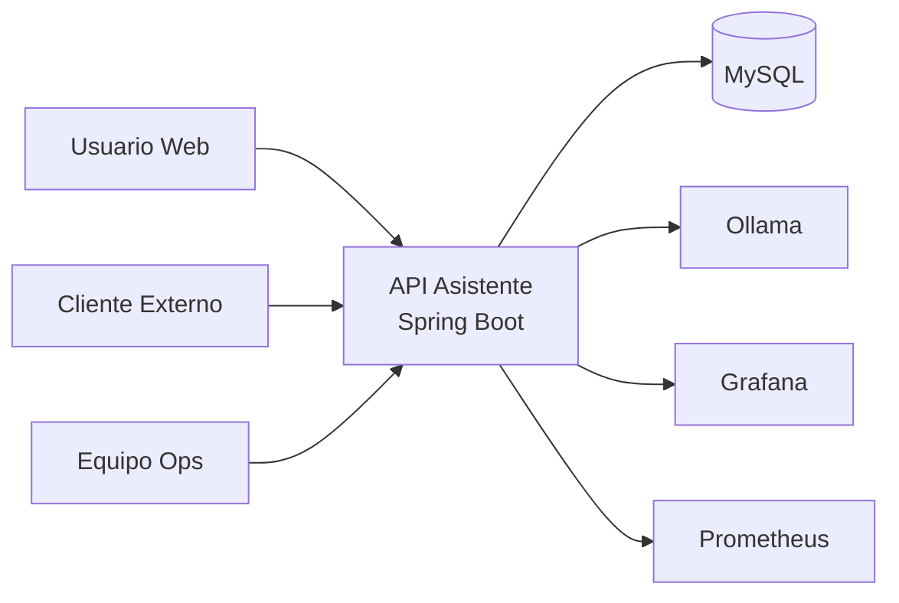
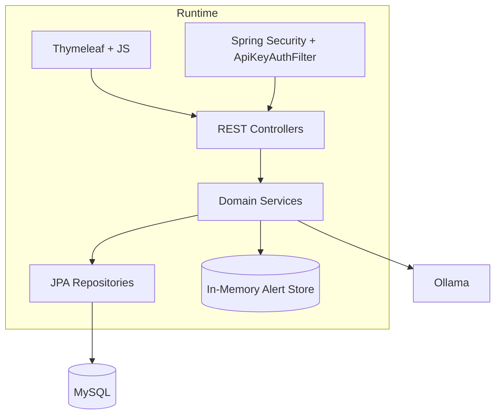
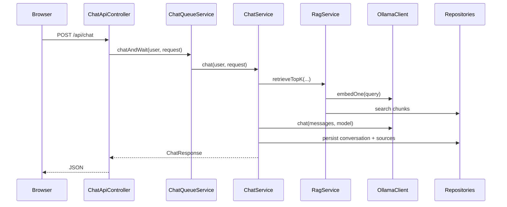
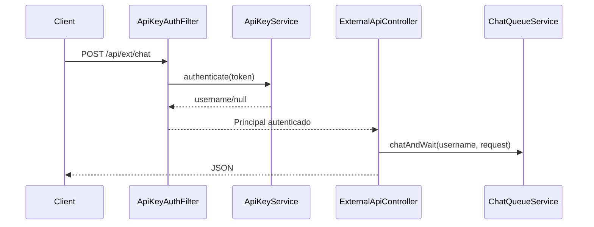
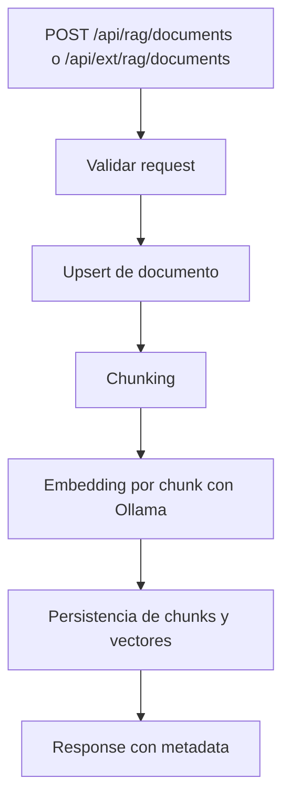
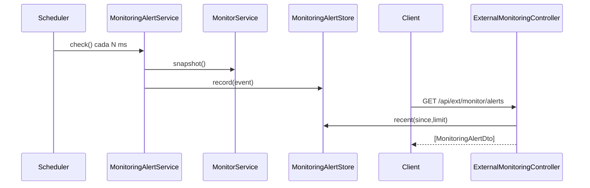

# Arquitectura de API Asistente

Este documento describe la arquitectura de referencia del sistema, sus componentes, limites, flujos operativos y decisiones clave.

## 1. Objetivo del sistema

API Asistente resuelve tres casos principales:
1. Chat con contexto enriquecido por RAG.
2. Ingesta de conocimiento y memoria persistente.
3. Monitoreo tecnico con alertas consumibles por UI y clientes externos.

## 2. Vista de contexto

## 3. Vista de contenedores

## 4. Componentes internos

| Capa | Responsabilidad | Ubicacion |
| --- | --- | --- |
| Controllers | Exponer contratos HTTP y validar entrada basica | `src/main/java/com/example/apiasistente/controller` |
| Services | Reglas de negocio, orquestacion de chat/RAG/monitor | `src/main/java/com/example/apiasistente/service` |
| Repositories | Acceso a datos via Spring Data JPA | `src/main/java/com/example/apiasistente/repository` |
| Security | Politicas de autenticacion/autorizacion | `src/main/java/com/example/apiasistente/security` |
| DTOs/Model | Contratos de request/response y entidades | `src/main/java/com/example/apiasistente/model` |
| UI | Vistas y scripts frontend | `src/main/resources/templates`, `src/main/resources/static` |

## 5. Flujos clave

### 5.1 Chat web con sesion

### 5.2 Chat externo con API key

### 5.3 Ingesta RAG

### 5.4 Monitoreo y alertas

## 6. Modelo de seguridad

El sistema usa dos cadenas de seguridad:
1. Web chain para rutas con sesion y CSRF.
2. External chain para `/api/ext/**` stateless y autenticacion por API key.

Headers soportados para API externa:
- `X-API-KEY: <token>`
- `Authorization: Bearer <token>`

## 7. Persistencia

- Motor: MySQL.
- Conversaciones: sesiones + historial de mensajes.
- RAG: documento fuente + chunks + embedding serializado.
- Alertas: buffer en memoria (no persistente), tamano configurable.

Implicaciones:
- Si el proceso reinicia, las alertas en memoria se pierden.
- El conocimiento RAG y chat persiste en DB.

## 8. Observabilidad

- Spring Actuator habilitado para `health`, `info` y `prometheus`.
- Integracion con Prometheus para scraping de metricas.
- Integracion de enlaces a Grafana/Prometheus para status operativo.

## 9. Decisiones de arquitectura

### ADR-001: Doble modo de autenticacion
- Decision: separar seguridad web y externa.
- Motivo: mantener UX web tradicional y API externa simple para integraciones.
- Tradeoff: mayor complejidad de configuracion de seguridad.

### ADR-002: Cola de chat por sesion
- Decision: serializar el procesamiento para evitar carreras en historial.
- Motivo: consistencia de mensajes y orden de respuestas.
- Tradeoff: menor throughput por sesion bajo alta concurrencia.

### ADR-003: Alert store en memoria
- Decision: guardar eventos recientes en `Deque` sincronizada.
- Motivo: latencia baja y simplicidad operativa.
- Tradeoff: no hay historico durable tras restart.

## 10. Riesgos y mejoras sugeridas

1. Persistir alertas en DB o cola para historico durable.
2. Agregar OpenAPI/Swagger para contrato publico versionado.
3. Endurecer pipeline con analisis estatico (SpotBugs/Checkstyle).
4. Incorporar pruebas de carga para chat externo y monitor.
