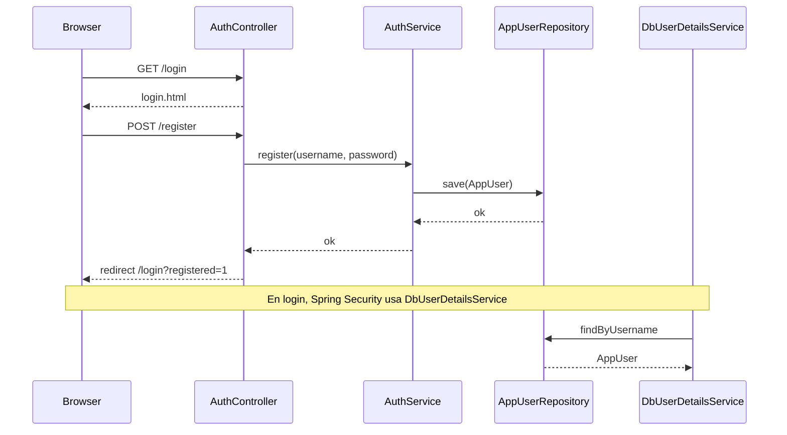
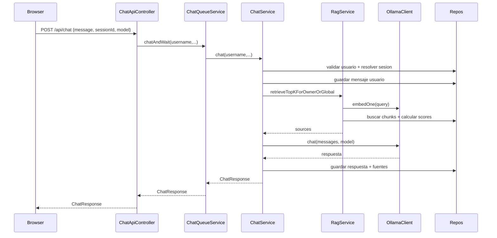
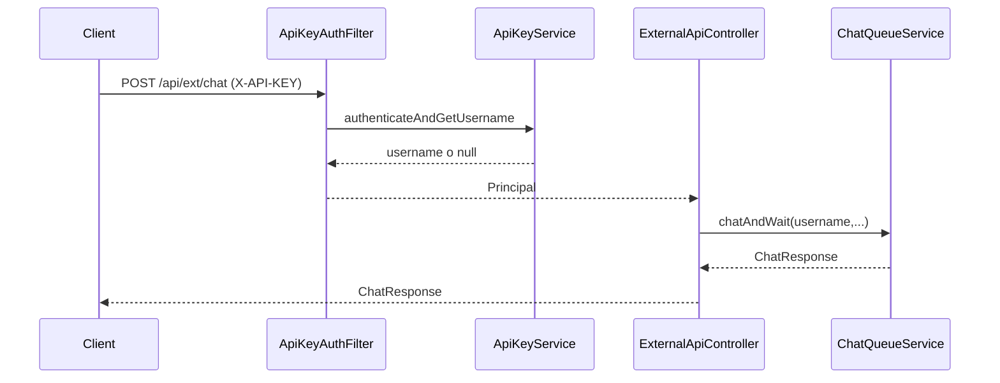
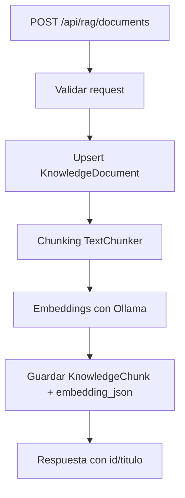
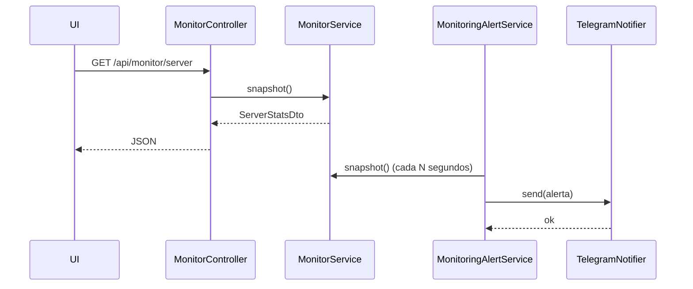
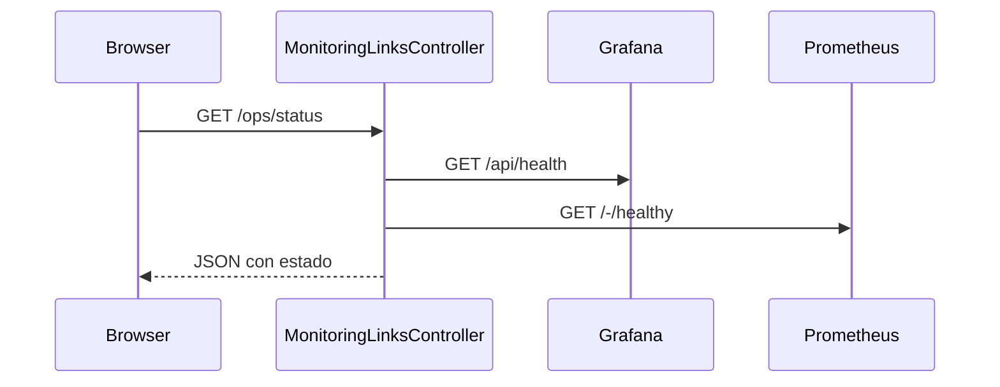

# Arquitectura y Flujos (API Asistente)

Este documento resume la arquitectura por capas y los flujos principales usando diagramas Mermaid.

## Mapa general (capas y dependencias)

```mermaid
flowchart LR
  UI[UI Web (Thymeleaf + JS)] --> REST[Controllers REST]
  UI --> MVC[Controllers MVC]

  REST --> SRV[Servicios de negocio]
  MVC --> SRV

  SRV --> JPA[Repositorios JPA]
  SRV --> OLLAMA[Ollama API]
  SRV --> MON[Monitoreo / Alertas]

  JPA --> DB[(MySQL)]
  MON --> TG[Telegram Bot API]

  subgraph Seguridad
    SEC[Spring Security + ApiKeyAuthFilter]
  end

  SEC --> REST
  SEC --> MVC
```

## Flujo de autenticacion web



## Flujo de chat interno (web con sesion)



## Flujo de chat externo (API key)



## Flujo RAG (ingesta)



## Flujo de monitoreo y alertas



## Flujo Ops Status (Grafana/Prometheus)



## Notas operativas

1. Las paginas web requieren login y usan sesiones.
2. Los endpoints `/api/ext/**` requieren API key y retornan 401 si falta o es invalida.
3. Los DTOs evitan exponer entidades JPA al frontend.
4. El monitoreo actual detecta CPU, memoria, disco y caidas de internet.
5. Las alertas por Telegram requieren `TELEGRAM_BOT_TOKEN` y `TELEGRAM_CHAT_ID`.
