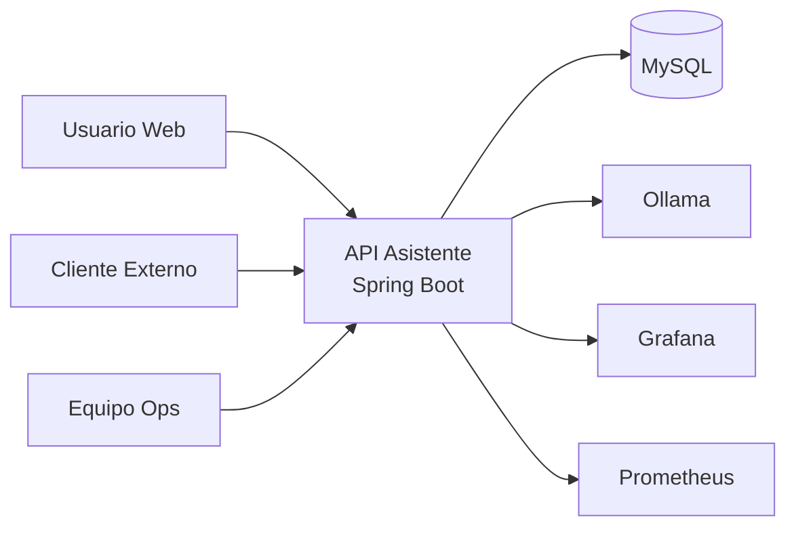
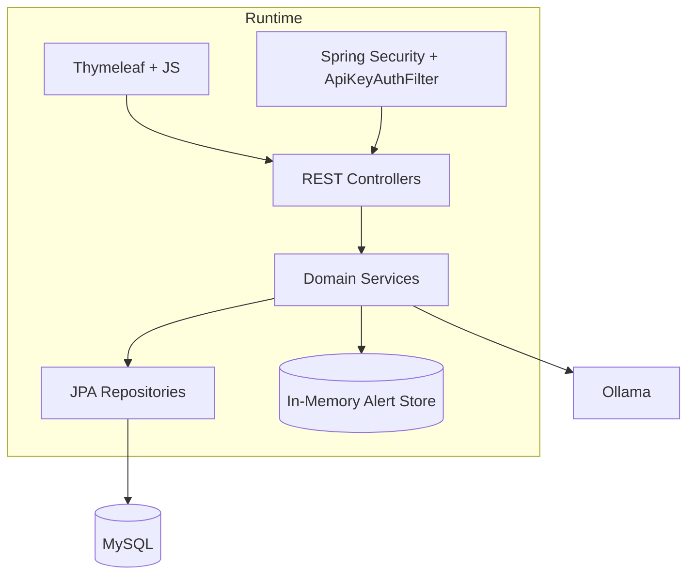
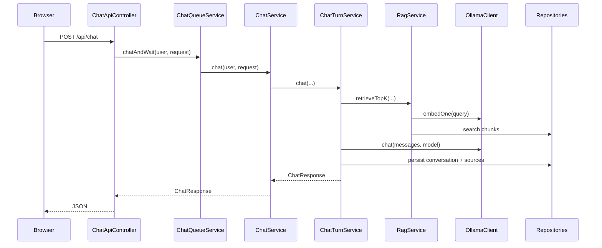
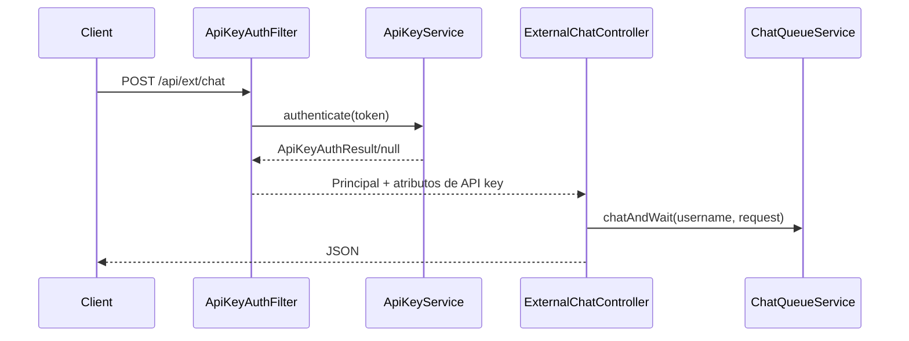
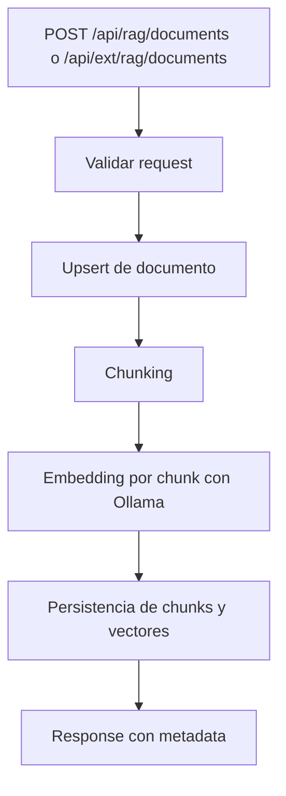
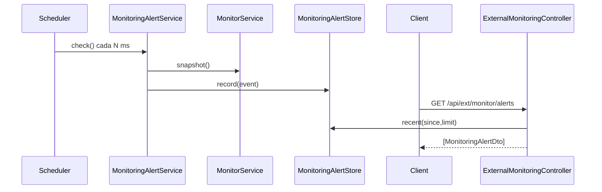

# Arquitectura de API Asistente

Este documento describe la arquitectura de referencia del sistema, sus componentes, limites, flujos operativos y decisiones clave.

## 1. Objetivo del sistema

API Asistente resuelve tres casos principales:
1. Chat con contexto enriquecido por RAG.
2. Ingesta de conocimiento y memoria persistente.
3. Monitoreo tecnico con alertas consumibles por UI y clientes externos.

## 2. Vista de contexto

```mermaid
flowchart LR
    Browser[Usuario Web]
    ExtClient[Cliente Externo]
    Ops[Equipo Ops]

    App[API Asistente\nSpring Boot]
    Mysql[(MySQL)]
    Ollama[Ollama]
    Grafana[Grafana]
    Prometheus[Prometheus]

    Browser --> App
    ExtClient --> App
    Ops --> App

    App --> Mysql
    App --> Ollama
    App --> Grafana
    App --> Prometheus
```

## 3. Vista de contenedores

```mermaid
flowchart TB
    subgraph Runtime
      WebUI[Thymeleaf + JS]
      ApiControllers[REST Controllers]
      Services[Domain Services]
      Security[Spring Security + ApiKeyAuthFilter]
      Persistence[JPA Repositories]
      AlertStore[(In-Memory Alert Store)]
    end

    DB[(MySQL)]
    LLM[Ollama]

    WebUI --> ApiControllers
    ApiControllers --> Services
    Security --> ApiControllers
    Services --> Persistence
    Services --> AlertStore
    Persistence --> DB
    Services --> LLM
```

## 4. Componentes internos

La base quedo reorganizada por feature para aislar mejor los flujos y reducir acoplamiento transversal.

| Feature | Responsabilidad | Ubicacion |
| --- | --- | --- |
| `apikey` | Alta, listado, revocacion y autenticacion de API keys | `src/main/java/com/example/apiasistente/apikey` |
| `auth` | Login, usuarios, permisos y configuracion de password | `src/main/java/com/example/apiasistente/auth` |
| `chat` | Controllers, DTOs, entidades, repositorios, cola y orquestacion de turnos | `src/main/java/com/example/apiasistente/chat` |
| `monitoring` | Endpoints, DTOs y servicios de monitoreo/alertas | `src/main/java/com/example/apiasistente/monitoring` |
| `prompt` | Gestion de prompts de sistema | `src/main/java/com/example/apiasistente/prompt` |
| `rag` | Ingesta, retrieval, DTOs, entidades, repositorios y utilidades vectoriales | `src/main/java/com/example/apiasistente/rag` |
| `registration` | Codigos de registro y bootstrap de permisos | `src/main/java/com/example/apiasistente/registration` |
| `shared` | Infraestructura comun: seguridad transversal, config, filtros, home/error handlers y cliente Ollama | `src/main/java/com/example/apiasistente/shared` |
| UI | Vistas y scripts frontend | `src/main/resources/templates`, `src/main/resources/static` |

### 4.1 Subdominio de chat

El flujo de chat se separa ahora en componentes especializados:

| Componente | Rol |
| --- | --- |
| `ChatService` | Fachada del dominio de chat para controllers y cola |
| `ChatTurnService` | Orquestador transaccional del turno y ensamblado de `ChatResponse` |
| `ChatTurnContextFactory` | Preparacion del turno: sesion, historial inmediato, adjuntos y modo de ejecucion |
| `ChatRagFlowService` | Retrieval, scoping por usuario externo y decision de grounding/RAG |
| `ChatAssistantService` | Construccion de mensajes, seleccion de modelo, ejecucion y retry/fallback |
| `ChatSessionService` | Ciclo de vida de sesiones, ownership y metadata |
| `ChatHistoryService` | Historial, persistencia de mensajes y enlaces a fuentes |
| `ChatPromptBuilder` | Construccion de prompts y seleccion de modelo final |
| `ChatMediaService` | Normalizacion de adjuntos y puente visual/documental |
| `ChatGroundingService` | Politica de grounding, validacion de citas y response-guard |
| `ChatTurnPlanner` | Heuristica de enrutado por turno (`ragNeeded`, `reasoningLevel`) |

### 4.2 Criterio de separacion

Cada feature mantiene, en la medida de lo posible, sus propios:
- `controller`
- `service`
- `dto`
- `entity`
- `repository`
- `config`

Solo la infraestructura realmente transversal queda en `shared`.

## 5. Flujos clave

### 5.1 Chat web con sesion

```mermaid
sequenceDiagram
    participant Browser
    participant ChatApiController
    participant ChatQueueService
    participant ChatService
    participant ChatTurnService
    participant RagService
    participant OllamaClient
    participant Repositories

    Browser->>ChatApiController: POST /api/chat
    ChatApiController->>ChatQueueService: chatAndWait(user, request)
    ChatQueueService->>ChatService: chat(user, request)
    ChatService->>ChatTurnService: chat(...)
    ChatTurnService->>RagService: retrieveTopK(...)
    RagService->>OllamaClient: embedOne(query)
    RagService->>Repositories: search chunks
    ChatTurnService->>OllamaClient: chat(messages, model)
    ChatTurnService->>Repositories: persist conversation + sources
    ChatTurnService-->>ChatService: ChatResponse
    ChatService-->>ChatApiController: ChatResponse
    ChatApiController-->>Browser: JSON
```

### 5.2 Chat externo con API key

```mermaid
sequenceDiagram
    participant Client
    participant ApiKeyAuthFilter
    participant ApiKeyService
    participant ExternalChatController
    participant ChatQueueService

    Client->>ApiKeyAuthFilter: POST /api/ext/chat
    ApiKeyAuthFilter->>ApiKeyService: authenticate(token)
    ApiKeyService-->>ApiKeyAuthFilter: ApiKeyAuthResult/null
    ApiKeyAuthFilter-->>ExternalChatController: Principal + atributos de API key
    ExternalChatController->>ChatQueueService: chatAndWait(username, request)
    ExternalChatController-->>Client: JSON
```

### 5.3 Ingesta RAG

```mermaid
flowchart TD
    A[POST /api/rag/documents o /api/ext/rag/documents] --> B[Validar request]
    B --> C[Upsert de documento]
    C --> D[Chunking]
    D --> E[Embedding por chunk con Ollama]
    E --> F[Persistencia de chunks y vectores]
    F --> G[Response con metadata]
```

### 5.4 Monitoreo y alertas

```mermaid
sequenceDiagram
    participant Scheduler
    participant MonitoringAlertService
    participant MonitorService
    participant MonitoringAlertStore
    participant Client
    participant ExternalMonitoringController

    Scheduler->>MonitoringAlertService: check() cada N ms
    MonitoringAlertService->>MonitorService: snapshot()
    MonitoringAlertService->>MonitoringAlertStore: record(event)
    Client->>ExternalMonitoringController: GET /api/ext/monitor/alerts
    ExternalMonitoringController->>MonitoringAlertStore: recent(since,limit)
    ExternalMonitoringController-->>Client: [MonitoringAlertDto]
```

## 6. Modelo de seguridad

El sistema usa dos cadenas de seguridad:
1. Web chain para rutas con sesion y CSRF.
2. External chain para `/api/ext/**` stateless y autenticacion por API key.

Headers soportados para API externa:
- `X-API-KEY: <token>`
- `Authorization: Bearer <token>`

## 7. Persistencia

- Motor: MySQL.
- Conversaciones: sesiones + historial de mensajes.
- RAG: documento fuente + chunks + embedding serializado.
- Alertas: buffer en memoria (no persistente), tamano configurable.

Implicaciones:
- Si el proceso reinicia, las alertas en memoria se pierden.
- El conocimiento RAG y chat persiste en DB.

## 8. Observabilidad

- Spring Actuator habilitado para `health`, `info` y `prometheus`.
- Integracion con Prometheus para scraping de metricas.
- Integracion de enlaces a Grafana/Prometheus para status operativo.

## 9. Decisiones de arquitectura

### ADR-001: Doble modo de autenticacion
- Decision: separar seguridad web y externa.
- Motivo: mantener UX web tradicional y API externa simple para integraciones.
- Tradeoff: mayor complejidad de configuracion de seguridad.

### ADR-002: Cola de chat por sesion
- Decision: serializar el procesamiento para evitar carreras en historial.
- Motivo: consistencia de mensajes y orden de respuestas.
- Tradeoff: menor throughput por sesion bajo alta concurrencia.

### ADR-003: Alert store en memoria
- Decision: guardar eventos recientes en `Deque` sincronizada.
- Motivo: latencia baja y simplicidad operativa.
- Tradeoff: no hay historico durable tras restart.

## 10. Riesgos y mejoras sugeridas

1. Persistir alertas en DB o cola para historico durable.
2. Agregar OpenAPI/Swagger para contrato publico versionado.
3. Endurecer pipeline con analisis estatico (SpotBugs/Checkstyle).
4. Incorporar pruebas de carga para chat externo y monitor.
